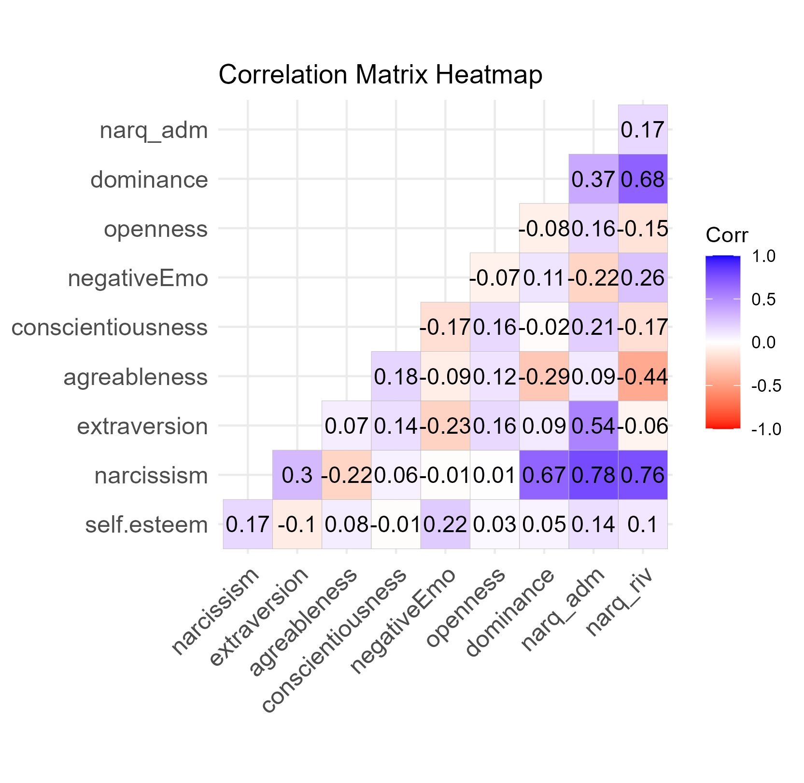

# Behavioral Data Analysis & Personality Insights (R)

## Overview
This project explores the relationships between self-esteem, narcissism, dominance, and personality traits using statistical analysis in R.

The goal was to understand how psychological variables interact and whether narcissism can predict self-esteem and dominance.

---

## Problem
Understanding human behavior is complex, especially when multiple psychological traits interact.

In real-world applications (e.g., customer analytics), identifying meaningful relationships between variables is essential for:
- segmentation
- personalization
- predictive modeling

---

## Solution
I developed a data analysis pipeline in R that:

- Processes and cleans survey data (N = 299 participants)
- Constructs psychological variables (Big Five, narcissism, self-esteem)
- Computes correlations between variables
- Tests hypotheses using regression models
- Visualizes relationships using heatmaps

---

## Technologies Used
- R
- tidyverse
- ggplot2
- ggcorrplot
- sjPlot
- flextable

---

## Key Results

### Correlation Analysis

The correlation matrix revealed several meaningful relationships:

- Narcissism is **positively correlated with extraversion** (r ≈ 0.30, p < 0.01)
- Narcissism is **negatively correlated with agreeableness** (r ≈ -0.22, p < 0.01)
- Strong positive relationships exist between narcissism dimensions (e.g., admiration & rivalry)

This supports the idea that narcissistic individuals tend to be **“disagreeable extroverts”**

---

### Regression Analysis

#### Hypothesis 1: Narcissism predicts Self-Esteem

- Statistically significant relationship (p < 0.01)
- Regression coefficient: **β ≈ 0.065**
- R² ≈ 0.03

Interpretation:
- Narcissism has a **positive but weak effect** on self-esteem  
- Only ~3% of the variance in self-esteem is explained  

---

#### Hypothesis 2: Self-Esteem & Narcissism predict Dominance

- Model not statistically significant
- R² ≈ 0.138
- Interaction effects were not meaningful

 Interpretation:
- These variables alone are **not sufficient to explain dominance**
- Other factors likely play a larger role

## Key Insights

- Psychological traits interact in complex, non-linear ways  
- Statistically significant relationships may still have **low predictive power**  
- Behavioral modeling requires combining multiple variables  

## Real-World Application

- **Customer segmentation** based on behavioral patterns  
- **Personalization systems** (recommendations, offers)  
- **User behavior analysis** in digital platforms  
- Supporting **AI-driven decision systems**
